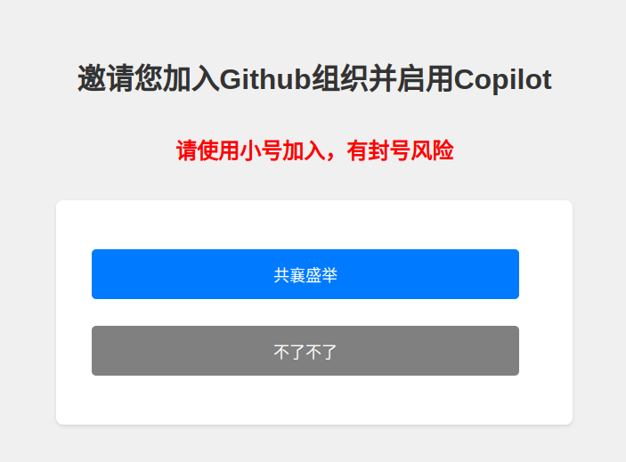
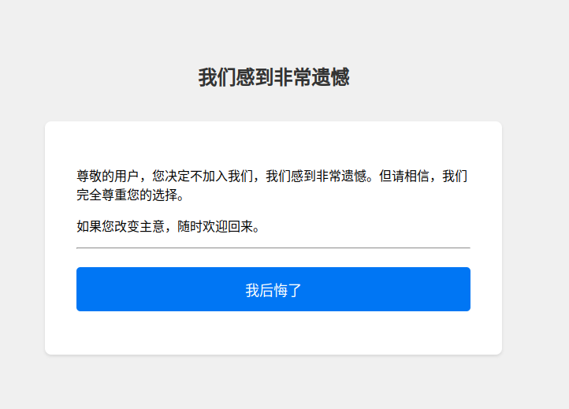

# README.md

## 项目介绍

这是一个使用Python和Flask框架构建的Web应用程序，主要功能是通过GitHub OAuth进行用户身份验证，并邀请他们加入指定的GitHub组织。项目使用了`python-dotenv`库来管理环境变量，`requests`库来发送HTTP请求，以及`gunicorn`作为WSGI HTTP服务器。

## 环境变量

- `CLIENT_ID`: GitHub OAuth应用的客户端ID。
- `CLIENT_SECRET`: GitHub OAuth应用的客户端密钥。
- `REDIRECT_URI`: GitHub OAuth应用的重定向URI {YOUR_DOMAIN}/callback。
- `ORGANIZATION_NAME`: 需要邀请用户加入的GitHub组织名称。
- `GITHUB_P_ACCESSTOKEN`: 用于邀请用户加入组织的GitHub个人访问令牌。

## 如何获取上述变量
1. 创建GitHub OAuth应用
   1. 登录到你的GitHub账户。
   2. 点击右上角的头像，然后选择"Settings"。
   3. 在左侧菜单中，选择"Developer settings"。
   4. 在左侧菜单中，选择"OAuth Apps"，然后点击"New OAuth App"。
   5. 在"Application name"字段中，输入你的应用名称,如github-invitor。
   6. 在"Homepage URL"字段中，输入你的应用主页URL。
   7. 在"Application description"字段中，输入你的应用描述（可选）。
   8. 在"Authorization callback URL"字段中，输入你的应用授权回调URL。这应该是你的应用在用户授权后将被重定向到的URL。这个回调地址`REDIRECT_URI`的格式应该是`http(s){YOUR_DOMAIN:YOUR_PORT}/callback`。
   9. 点击"Register application"。 
   10. 在创建应用后，你将看到你的`CLIENT_ID`和`CLIENT_SECRET`。 
2. 创建GitHub组织
   1. 登录到你的GitHub账户。
   2. 点击右上角的头像，然后选择"Your organizations"。
   3. 点击"New organization"。
   4. 选择组织的计划类型，可以选择免费的"Free"计划，然后点击"Next"。
   5. 在"Organization account name"字段中，输入你的组织名称`ORGANIZATION_NAME`。
   6. 在"Contact email"字段中，输入你的联系邮箱。
   7. 选择你的组织类型，可以是"Business"或"Non-profit"。
   8. 阅读并接受GitHub的条款，然后点击"Create organization"。
   9. 如果你需要在创建组织的时候勾选Copilot来来启用Copilot， 需要填写付款信息等。
3. 创建GitHub个人访问令牌
   1. 登录有组织管理员权限的GitHub账户（上述你创建组织的账户肯定是有组织管理员权限的）。
   2. 点击右上角的头像，然后选择"Settings"。
   3. 在左侧菜单中，选择"Developer settings"。
   4. 在左侧菜单中，选择"Personal access tokens"，然后点击"Generate new token"。
   5. 这个token需要有`admin:org`权限，用于邀请用户加入组织。
   6. 这个token就是`GITHUB_P_ACCESSTOKEN`。

## 如何启动项目

1. 克隆项目到本地。
2. 在项目根目录下创建一个`.env`文件，并填写上述步骤中获取到的环境变量。
3. 安装项目依赖：`pip install -r requirements.txt`。
4. 启动项目：`python main.py`。

## 如何构建Docker镜像

在项目根目录下运行以下命令：

```shell
docker build -t github-org-invite-py .
```

## Docker启动示例命令

```shell
docker run \
--restart=always \
--name github-org-invite-py \
-e CLIENT_ID=your_client_id \
-e CLIENT_SECRET=your_client_secret \
-e REDIRECT_URI=your_redirect_uri \
-e ORGANIZATION_NAME=your_organization_name \
-e GITHUB_P_ACCESSTOKEN=your_github_p_accesstoken \
-p 18989:18989 \
-d atmudccc/github-org-invite-py:latest
```

以上命令将会启动一个Docker容器，应用将在容器的18989端口上运行，并映射到宿主机的18989端口。

## 如何访问
1. 正常访问之前， 需要在GitHub OAuth应用中设置`REDIRECT_URI`为`http(s){YOUR_DOMAIN:YOUR_PORT}/callback`， 如： `http://127.0.0.1:18989/callback` 。
2. 访问`http://127.0.0.1:18989`， 你将会看到如下界面：
   
3. 点击`共襄盛举`按钮，你将会被重定向到GitHub的授权页面，授权成功后，你将会被重定向到你设置的`REDIRECT_URI`。
4. 然后你就可以点击下图中的 `前往使用说明` 按钮， 愉快地开车了。
   
5. 如果你不想加入这个~~团伙~~组织， `不了不了`按钮是专门为你准备的。
6. 你以为不了不了就不了吗？ 不了不了是不了， 你还是会后悔的，我们给你提供了一个`我后悔了`按钮。
   

## 其他说明

- 项目使用了`Flask`框架，所有的路由定义都在`app/routes.py`文件中。
- `app/utils.py`文件包含了所有的辅助函数，如获取访问令牌、获取用户登录ID以及邀请用户加入组织等。
- `app/config.py`文件用于加载环境变量并存储在`Config`类中，以便在项目中使用。
- `Dockerfile`文件定义了如何在Docker容器中运行应用。
- `run.sh`是一个shell脚本，用于在Docker容器中启动应用。